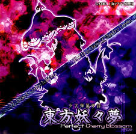
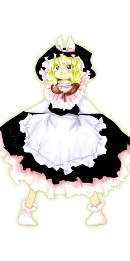

# 4조 C언어 팀 프로젝트 소개
---
     향후 (경력직) 게임 업계 진출을
     목적으로 포트폴리오를 제작하였습니다.
---

---

## 본 프로젝트는 2차 창작입니다.

> 동방 프로젝트의 슈팅 게임을 모티브로 하여 영감을 받아 제작하게 된  
> 대학교 팀 프로젝트(연습작) 입니다.  
> 본 프로젝트는 전체 빌드 과정을 제외한  
> 모든 스크립트 및 헤더파일은 C코드로 구성 되어있습니다.

> 2차 창작 가이드라인을 준수하고 있음을 알립니다.

---

# 캐릭터 소개

> **하쿠레이 레이무**  
> 

> **마리사**  
> 

---

# 스테이지 소개

> **스테이지 1**  
> 스테이지 1에 대한 설명을 추가할 수 있습니다.

---

# 보스 소개

> **보스 정보**  
> 보스의 이름과 설명을 여기에 추가할 수 있습니다.

---

# 브금(BGM) 소개

> **브금(BGM) 소개**  
> 브금에 대한 설명이나 트랙 목록을 여기에 추가할 수 있습니다.

---
# 구현(업데이트) 예정.

> CI / CD 파이프라인 > 깃 액션 학습 중.
> #
> aps 빌드
---

# 역할 소개

> **올라운더** : 필    
> **사운드 수집 & 음향 파일 관리** : 서  
> **자료조사 & 발표** : 윤

# 코멘트..
리더 코딩 역량 부족으로 인해 백엔드 감당 불가능 파기 예정...